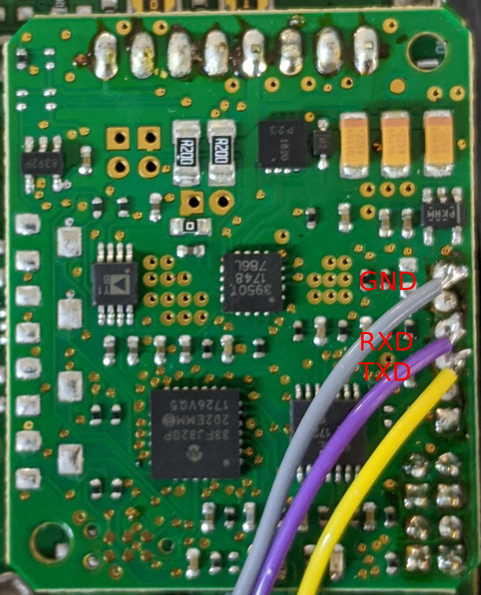

# Enfield S3 Serial Protocol Documentation

## Introduction

This documentation is incomplete and generated by watching the communication
between the Enfield configuration tool and a valve. The USB connection is
converted to serial on the bottom of the two boards inside the servo, I connected
after this conversion as shown here:

To monitor communication, RXD and TXD were each connected to the Receive wire of
another serial port on a second laptop and `twocolumn.py` was used to monitor
the data flow while interacting with the tool. Once the protocol was clear,
`enfield.py` was written to send and receive messages.

## The Protocol

Packets sent in both directions are fixed size and checksummed. All messages are
checksummed using the `modbus` CRC. Every valid packet produces a response, the
valve never sends an unrequested packet. Baud rate is 115200.

### Commands

Commands are sent to the valve and have the format

    $CrVV#CC

`r` identifies the target of the command and `VV` is a 16-bit payload. `CC` is
the CRC.

### Responses

Responses from the valve have the format

    +VV#CC

The returned 16 bit data is `VV`and the checksum is `CC`

### Observed Reads

The following `r` values return data about the valve and do not seem to affect
its operation. When reading, `VV` in the command packet is always set to 0x1111.
See the manual for a description of what each parameter means.

Name             | `r` |      | Range   | Description
-----------------|-----|------|---------|-------------
ProportionalGain | 112 | 0x70 | 0-1000  | interpreted as 0-100.0%
DerivativeGain   | 113 | 0x71 | 0-1000  | 
                 |     | 0x72 |         |
ForceDamping     | 119 | 0x77 | 0-1000  | 
Offset           | 126 | 0x7E | 0-1000  | 
CommandInput     | 127 | 0x7F | 0-1     | 
FeedbackInput    | 128 | 0x80 | 0-1     | 
AreaRatio        | 129 | 0x81 | 0-32767 | 32767 * (rod end piston area / bore area)
CylinderBore     | 130 | 0x82 | 0-32767 | 1024 * Cylinder Bore in inches
MinimumPosition  | 131 | 0x83 | 0-1000  | 
MaximumPosition  | 132 | 0x84 | 0-1000  | 
PortConnection   | 133 | 0x85 | 0-1     | 
RampUp           | 134 | 0x86 | 0-1000  | 
RampDown         | 135 | 0x87 | 0-1000  | 
DeadBand         | 137 | 0x88 | 0-1000  | 
DitherAmplitude  | 138 | 0x89 | 0-1000  | 
ValveOffset      | 139 | 0x8A | 0-1000  | 
Unknown          | 140 | 0x8B |         | response is 0x0000
FeedbackPolarity | 144 | 0x90 | 0-1     | 
DigitalCommand   | 145 | 0x91 | 0-4095  | 
CommandSource    | 146 | 0x92 | 0-1     | 
SerialNumberLo   | 147 | 0x93 |         | response is 0x79db
SerialNumberHi   | 148 | 0x94 |         | response is 0x0000
Unknown          | 149 | 0x95 |         | Only seen as first command, data is 0x2222 response is 0x0000
AnalogCommand    | 152 | 0x98 | 0-4095  | Read continuously by Enfield tool
FeedbackPosition | 153 | 0x99 | 0-4095  | Read continuously by Enfield tool
BaseEndPressure  | 154 | 0x9A |         | 
RodEndPressure   | 155 | 0x9B |         | 
SpoolPosition    | 158 | 0x9E | 0-4096  | Idles at 2048
FirmwareVersionB | 161 | 0xa1 | 0       | startup, response is 0000
FirmwareVersionA | 162 | 0xa2 | 0       | startup, response is 0a00
FirmwareRevLow   | 163 | 0xa3 | 0       | startup, response is 3030
FirmwareRevHigh  | 164 | 0xa4 | 0       | startup, response is 4520 "33-0010-0000 E00" 
Unknown          | 177 | 0xb1 | 0       | data 0x0000 on Enfield tool startup, response is 0xa00f
Unknown          | 185 | 0xb9 | 0       | data 0x0000 on Enfield tool startup, response is 0x0000

### Observed Writes

These operations change the state of the servo, but are not persisted across
power cycles until `SaveConfiguration` is sent.

Name              | 'r' | Range   | Description
------------------|-----|---------|------------
ProportionalGain  | 1   | 0-1000  |
DerivativeGain    | 2   | 0-1000  |
ForceDamping      | 8   | 0-1000  |
Offset            | 15  | 0-1000  |
CommandInput      | 16  | 0-1     | 0-4-20mA, 1-0-10v
FeedbackInput     | 17  | 0-1     | 0-4-20mA, 1-0-10v
AreaRatio         | 18  | 0-32767 | 32767 * (rod end piston area / bore area)
CylinderBore      | 19  | 0-32767 | 1024 * Cylinder Bore diameter in inches
MinimumPosition   | 20  | 0-1000  |
MaximumPosition   | 21  | 0-1000  |
PortConnection    | 22  | 0-1     | 0-standard, 1-transposed
RampUp            | 23  | 0-1000  |
RampDown          | 24  | 0-1000  |
DeadBand          | 26  | 0-1000  |
DitherAmplitude   | 27  | 0-1000  |
ValveOffset       | 28  | 0-1000  |
FeedbackPolarity  | 33  | 0-1     | 0-normal, 1-inverted
CommandSource     | 89  | 0-1     | 1-analog, 0-slider
DigitalCommand    | 88  | 0-4095  |
SetZeroGains      | 224 | 0       | always written 0 after changing command input type
SaveConfiguration | 225 | 0       | write 0 to save configuration
