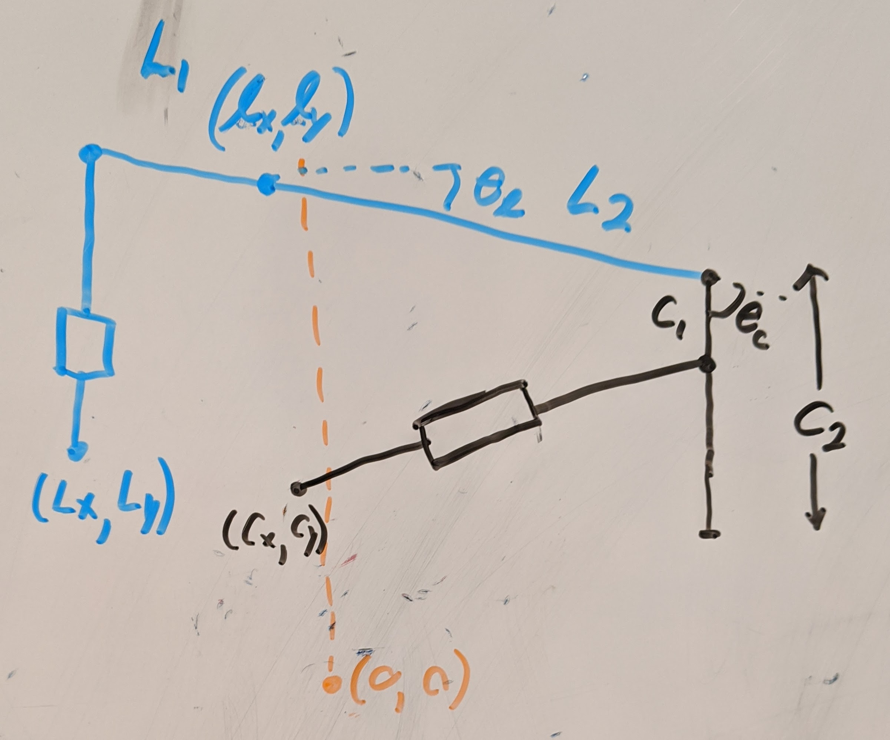
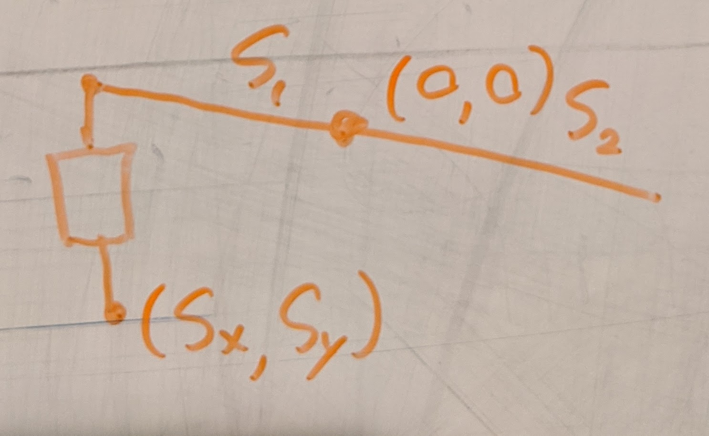

# Linearization of feedback

The Enfield servos need cylinder length feedback, our systems measures joint
angles on a four-bar linkage.

## Definition of Symbols

Values measured during operation.

| Measurement  | Description                   |
|--------------|-------------------------------|
| $\theta_l$   | Measured by Lift angle sensor |
| $\theta_c$   | Measured by Curl angle sensor |
| $\theta_s$   | Measured by Swing angle sensor |

Parameters determined by leg geometry.

| Parameter |     Value (m)     | Description                                                    |
|-----------|-------------------|-----------------------------------------------------------------
| $(l_x, l_y)$ | $( 0.041,  0.000)$ | Position of Lift Link Pivot relative to Swing Pivot |
| $(L_x, L_y)$ | $(-0.068, -0.052)$ | Position of Lift Cylinder Pivot relative to Swing Pivot |
| $(C_x, C_y)$ | $( 0.041, -0.064)$ | Position of Curl Cylinder Pivot relative to Swing Pivot |
| $L_1$     | $0.11176$  | Length of link from Lift Cylinder Rod End to Lift Cylinder Pivot |
| $L_2$     | $0.16002$  | Length of link from Lift Cylinder Pivot to Curl Link Pivot     |
| $C_4$     | $0.0635$   | Distance from Curl Cylinder Pivot to Lift Link Pivot           |
| $C_1$     | $0.0635$   | Length of link from Curl Link Pivot to Curl Cylinder Rod End   |
| $C_2$     | $0.2032$   | Length of Curl Link                                            |
| $S_1$     | $0.09906$   | Length of link from Swing Cylinder Rod End to Swing Cylinder Pivot |
| $S_3$     | $0.112458$ | Length of link from Swing Cylinder Pivot to Swing Link Pivot   |
| $(S_x, S_y)$ | $(-0.092, -0.065)$ | Position of Swing Cylinder Pivot relative to Swing Pivot|
| $R_c^{\textrm{min}}$ | $0.14732$ | Minimum distance from Curl Cylinder Pivot to Curl Cylinder Rod End |
| $R_c^{\textrm{max}}$ | $0.17272$ | Maximum distance from Curl Cylinder Pivot to Curl Cylinder Rod End |
| $R_l^{\textrm{min}}$ | $0.027178$ | Minimum distance from Lift Cylinder Pivot to Lift Cylinder Rod End |
| $R_l^{\textrm{max}}$ | $0.07747$ | Maximum distance from Lift Cylinder Pivot to Lift Cylinder Rod End |
| $R_s^{\textrm{min}}$ | $0.027432$ | Minimum distance from Swing Cylinder Pivot to Swing Cylinder Rod End |
| $R_s^{\textrm{max}}$ | $0.0653288$ | Maximum distance from Swing Cylinder Pivot to Swing Cylinder Rod End |

## Solve with complex variables

The lift cylinder loop is

$$ L + R_l e^{i \alpha_l} + L_1 e^{i \theta_l} = l $$
$$ R_l e^{i \alpha_l} = l - L - L_1 e^{i \theta_l} $$
$$ R_l = \left\| l - L - L_1 e^{i \theta_l} \right\| $$

The curl cylinder loop is

$$ C + R_c e^{i \alpha_c} - C_1 e^{i (\theta_c + \theta_l)} - L_2 e^{i \theta_l} \
   = l $$

$$ R_c e^{i \alpha_c} = l - C + C_1 e^{i (\theta_c + \theta_l)} + L_2 e^{i \theta_l} $$
$$ R_c = \left\| l - C + C_1 e^{i (\theta_c + \theta_l)} + L_2 e^{i \theta_l} \right\| $$

The swing loop is

$$ S + R_s e^{i \alpha_s} + S_1 e^{i \theta_s} = 0 $$

$$ R_s = \left\|-S - S_1 e^{i \theta_s}\right\| $$

# Toe position to cylinder lengths

The previous result gives cylinder lengths in terms of join angles, so just
solve for joint angles in terms of toe position.

Toe position in terms of joint angles

$$ l + L_2 e^{i \theta_l} + C_2 e^{i (\theta_l + \theta_c)} = T $$

First isolate and solve for $\theta_c$

$$ L_2 e^{i \theta_l} + C_2 e^{i (\theta_l + \theta_c)} = T - l $$
$$ e^{i \theta_l} (L_2 + C_2 e^{i \theta_c}) = T - l $$
$$ \|L_2 + C_2 e^{i \theta_c}\| = \|T - l\| $$
$$ (L_2 + C_2 \cos(\theta_c))^2 + C_2^2 \sin^2(\theta_c) = \|T - l\|^2 $$
$$ L_2^2 + 2 L_2 C_2 \cos(\theta_c) + C_2^2 \cos^2(\theta_c) + C_2^2 (1-\cos^2(\theta_c)) = \|T - l\|^2 $$
$$ L_2^2 + 2 L_2 C_2 \cos(\theta_c) + C_2^2 = \|T - l\|^2 $$
$$ 2 L_2 C_2 \cos(\theta_c) C_2^2 = \|T - l\|^2 - (L_2^2 + C_2^2) $$
$$ \theta_c = \pm \arccos\left(\frac{\|T - l\|^2 - (L_2^2 + C_2^2)}{2 L_2 C_2}\right) $$

The positive branch is not physical, use the negative one.

Solve for $\theta_l$

$$ e^{i \theta_l} = \frac{T - l}{L_2 + C_2 e^{i \theta_c}}$$
$$ \theta_l = \
\arcsin\left(\Im\left(\frac{T - l}{L_2 + C_2 e^{i \theta_c}}\right)\right)$$
