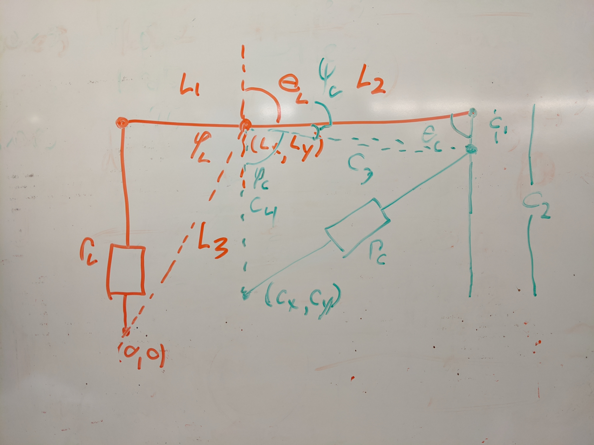

# Linearization of feedback

The Enfield servos need cyldiner length feedback, our systems measures joint
angles on a four-bar linkage.

## Definition of Symbols

Values measured during operation.

| Measurement  | Description                   |
|--------------|-------------------------------|
| $\theta_l$   | Measured by Lift angle sensor |
| $\theta_c$   | Measured by Lift angle sensor |

Parameters determined by leg geometry.

| Parameter | Value (in) | Description                                                    |
|-----------|------------|-----------------------------------------------------------------
| $(L_x, L_y)$ | $(4.287, 2.06)$ | Position of Lift Link Pivot relative to Lift Cylinder Pivot |
| $L_1$     | $4.4$      | Length of link from Lift Cylinder Rod End to Lift Cylinder Pivot |
| $L_2$     | $6.3$      | Length of link from Lift Cylinder Pivot to Curl Link Pivot     |
| $(C_x, C_y)$ | $(4.287, -0.44)$ | Position of Curl Cylinder Pivot relative to Lift Link Pivot |
| $C_4$     | $2.5$      | Distance from Curl Cylinder Pivot to Lift Link Pivot           |
| $C_1$     | $2.5$      | Length of link from Curl Link Pivot to Curl Cylinder Rod End   |
| $C_2$     |            | Length of Curl Link                                            |
| $S_1$     | $3.90$     | Length of link from Swing Cylinder Rod End to Swing Cylinder Pivot |
| $S_3$     | $4.427$    | Length of link from Swing Cylinder Pivot to Swink Link Pivot   |
| $(S_x, S_y)$ | $(3.603, 2.572)$ | Position of Swing Link Pivot relative to Swing Cylinder Pivot|
| $R_c^{\textrm{min}}$ | $5.8$ | Minimum distance from Curl Cylinder Pivot to Curl Cylinder Rod End |
| $R_c^{\textrm{max}}$ | $6.8$ | Maximum distance from Curl Cylinder Pivot to Curl Cylinder Rod End |
| $R_l^{\textrm{min}}$ | $1.07$ | Minimum distance from Lift Cylinder Pivot to Lift Cylinder Rod End |
| $R_l^{\textrm{max}}$ | $3.05$ | Maximum distance from Lift Cylinder Pivot to Lift Cylinder Rod End |
| $R_s^{\textrm{min}}$ | $1.080$ | Minimum distance from Swing Cylinder Pivot to Swing Cylinder Rod End |
| $R_s^{\textrm{max}}$ | $2.572$ | Maximum distance from Swing Cylinder Pivot to Swing Cylinder Rod End |

## Solve with trigonometry

Find for $R_l$ by solving the triangle $((0,0), (L_x, L_y), \textrm{lift
cylinder rod end})$. First, solve fo the interior angle $\varphi_l$

$$ \varphi_l =  \theta_l - \arctan{\frac{L_x}{L_y}}$$

The third leg of the triangle is

$$ L_3 = \sqrt{L_x^2 + L_y^2} $$

Then use the law of cosines to find $R_l$

$$ R_l = L_1^2 + L_3^2 - 2 L_1 L_3 \cos{\varphi_l} $$

Solve the triangle $((C_x, C_y), (L_x, L_y), \textrm{curl cylinder rod end})$ to
find $L_c$. First, find the two opposite edges.

$$ C_3 = L_2^2 + C_1^2 - 2 L_2 C_1 \cos{\theta_c} $$

And the opposite angle

$$ sin(\psi_c) / C_1 = sin(\theta_c) / C_3 $$
$$ \varphi_c = \pi - \theta_l - \psi_c $$

Use the law of cosines to find $R_c$

$$ R_c = C_3^2 + C_4^2 - C_3 C_4 \cos{\varphi_c} $$

The actual cylinder length is $R_c - R_c^{\textrm{min}}$

## Solve with complex variables

This makes more sense with slightly different angle definitions.

The lift cylinder loop is

$$ R_l e^{i \alpha_l} + L_1 e^{i \theta_l} = L_x + i L_y $$
$$ R_l e^{i \alpha_l} = L_x + i L_y - L_1 e^{i \theta_l} $$
$$ R_l = \left\| L_x + i L_y - L_1 e^{i \theta_l} \right\| $$

The curl cylinder loop is

$$ C_x + i C_y + R_c e^{i \alpha_c} - C_1 e^{i (\theta_c + \theta_l)} - L_2 e^{i \theta_l} \
   = L_x + i L_y $$

$$ R_c e^{i \alpha_c} = L_x + i L_y - C_x - i C_y + C_1 e^{i (\theta_c + \theta_l)} + L_2 e^{i \theta_l} $$
$$ R_c = \left\|L_x + i L_y - C_x - i C_y + C_1 e^{i (\theta_c + \theta_l)} + L_2 e^{i \theta_l}\right\| $$

The swing loop is

$$ R_s e^{i \alpha_s} + S_1 e^{i \theta_s} = S_x + i S_y $$

$$ R_s = \left\|S_x + i S_y - S_2 e^{i \theta_s}\right\| $$

# Toe position to cylinder lengths

Toe position in from angles

$$ T = L_x + i L_y + L_2 e^{i \theta_l } + C_2 e^{i (\theta_l + \theta_c)} $$

The loops from above with the cylinders.

$$ C_x + i C_y + R_c e^{i \alpha_c} - C_1 e^{i (\theta_c + \theta_l)} - L_2 e^{i \theta_l} \
   = L_x + i L_y $$

$$ R_l e^{i \alpha_l} + L_1 e^{i \theta_l} = L_x + i L_y $$

Substitute for angular terms

$$ e^{i \theta_l} = \frac{L_x + i L_y - R_l e^{i \alpha_l}}{L_1} $$

$$ e^{i (\theta_c + \theta_l)} = \frac{L_x + i L_y - C_x - i C_y - \
   R_c e^{i \alpha_c} + L_2 \frac{L_x + i L_y - R_l e^{i \alpha_l}}{L_1}}{-C_1} $$

$$ T = L_x + i L_y + L_2 \frac{L_x + i L_y - R_l e^{i \alpha_l}}{L_1} + \
   C_2  \frac{L_x + i L_y - C_x - i C_y - \
   R_c e^{i \alpha_c} + L_2 \frac{L_x + i L_y - R_l e^{i \alpha_l}}{L_1}}{-C_1} $$
